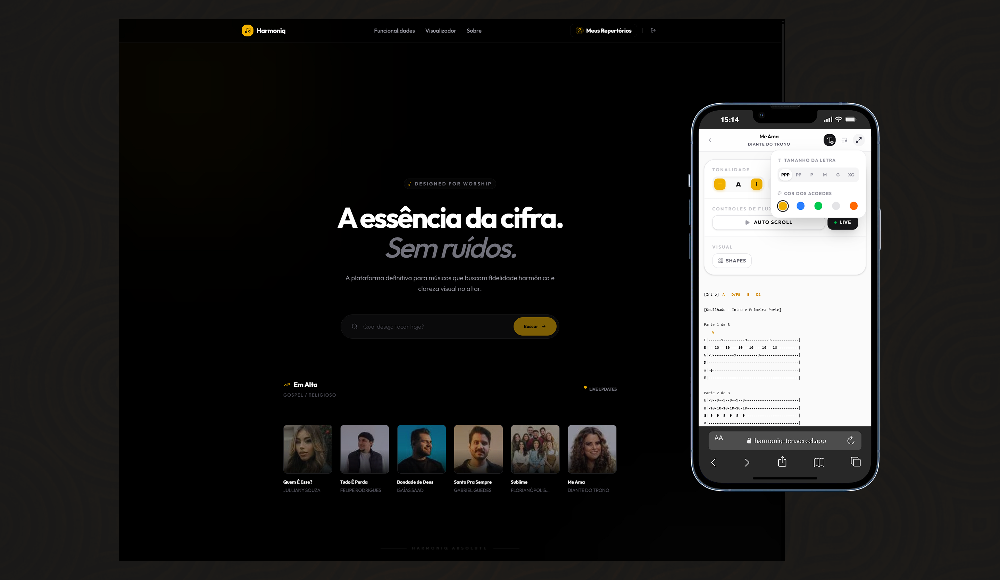

# Harmoniq - Digital Songbook & Chord Library

Plataforma moderna, intuitiva e responsiva desenvolvida para músicos que buscam profissionalismo e agilidade no gerenciamento de repertórios. O **Harmoniq** elimina a complexidade das cifras estáticas, oferecendo uma experiência dinâmica de transposição e visualização de acordes.

<h1 align="center">
  
</h1>

---

## 🚀 Funcionalidades que facilitam seu Show

O Harmoniq foi desenhado para ser o braço direito do músico no palco e no ensaio. Confira os principais recursos:

### 1. 🎸 Sistema Universal de Acordes

- **Shapes Dinâmicos:** Visualize diagramas de acordes baseados em formas reais (E, A, C, D, G) em vez de imagens estáticas.
- **Variações Infinitas:** Explore diferentes posições no braço do instrumento para o mesmo acorde com um clique.
- **Visualização Premium:** Diagramas nítidos com indicação de dedos, casas e pestanas para facilitar a leitura.

### 2. 🎼 Song Viewer Inteligente

- **Transposição Instantânea:** Mude o tom de qualquer música com um toque, preservando as variações de acordes escolhidas.
- **Auto-Scroll Adaptativo:** Configure a velocidade de rolagem para acompanhar a música sem precisar das mãos.
- **Filtro de Tablaturas:** Oculte partes instrumentais com um clique para focar apenas na letra e nos acordes (Cifra Pura).
- **Suporte a Múltiplas Versões**: Alterne entre todas as versões disponíveis (Simplificada, Versão 3, 4, etc.) através de um menu intuitivo.
- **Toque Também (Recomendações)**: Desvende novas músicas com um sistema de sugestões curadas baseadas no artista e gênero que você está tocando.
- **Modo Live (Performance):** Interface otimizada (Dark Mode) para uso em palcos, com fontes ampliadas e alto contraste.
- **Identidade Visual de Artista**: Fotos oficiais de perfil integradas ao cabeçalho para uma experiência profissional e imersiva.

### 3. 📊 Gestão de Repertórios (Setlists)

- **Organização por Show:** Crie e edite setlists personalizados para cada evento ou ensaio.
- **Persistência de Ajustes:** Salve o tom ideal e as variações de cada acorde especificamente para cada música de um repertório.
- **Navegação Ágil:** Alterne entre as músicas da sua lista com atalhos rápidos de "Anterior" e "Próxima".

### 4. 🔗 Compartilhamento e Sincronia

- **Links Públicos:** Compartilhe seus repertórios com sua banda ou alunos através de links simplificados.
- **Visualização Web:** Os membros da banda podem ver a cifra transposta em tempo real em qualquer dispositivo.

### 5. 📱 Experiência de Aplicativo (PWA)

- **Instalação Nativa:** Adicione o Harmoniq à sua tela inicial no iOS ou Android para usá-lo como um aplicativo real, sem barras de navegador.
- **Acesso de Elite:** Carregamento ultra-rápido, splash screen personalizada e visualização em tela cheia para foco absoluto no seu instrumento.

---

## 🛠️ Tecnologias

  
  
  
  
  
  
  

---

## 📅 Histórico de Versões (v1.6.0)

Confira todas as melhorias e novos recursos em nosso log oficial:
👉 **[Ver Histórico Completo em RELEASES.md](RELEASES.md)**

---

## 👨💻 Time e Desenvolvimento

  
   
  <strong>Jonatas Silva</strong>
   
  Senior Software Engineer / CTO & Tech Lead at <a href="https://pokernetic.com/">PokerNetic</a>

---

## 📄 Licença

Este projeto é privado e de uso exclusivo da **Harmoniq Inc**.

  Built with ❤️ by <a href="https://github.com/JsCodeDevlopment">Jonatas Silva</a>

